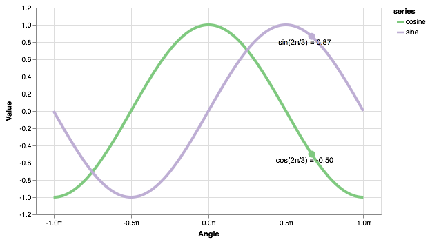
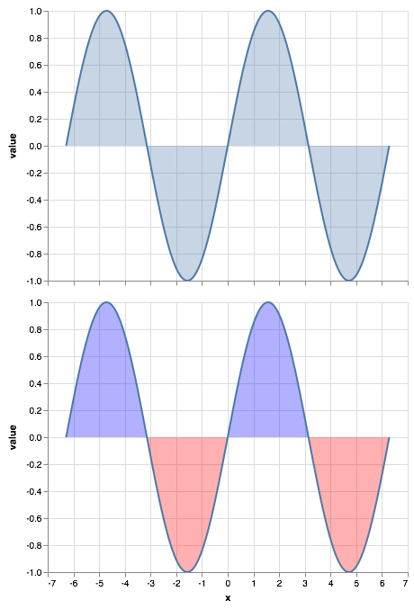
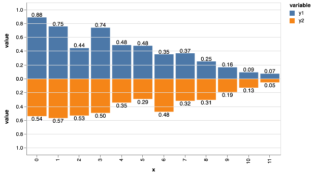

# Altair-Matplotlib

Ports of examples from a Nicolas P. Rougier's [Matplotlib tutorial](http://www.labri.fr/perso/nrougier/teaching/matplotlib/) to [Altair](https://altair-viz.github.io)/[Vega](https://vega.github.io/vega/).

# Tutorials

| Tutorial | |
| --- | --- |
| [Simple Plot](notebooks/01-Simple_Plot.ipynb) |  |
| [Regular Plots](notebooks/02-Regular_Plots.ipynb) |  |
| [Scatterplots](notebooks/03-Scatterplots.ipynb) |  |
| [Bar Chart](notebooks/04-Bar_Charts.ipynb) |  |
